# HolmiumOS

HolmiumOS is a custom operating system project developed in C# using the CosmosOS.

It extends the CosmosOS environment with its own kernel architecture, shell system, command framework, user management, filesystem utilities, graphical user interface, networking components, cryptographic tools, and additional system features.

## Screenshots

  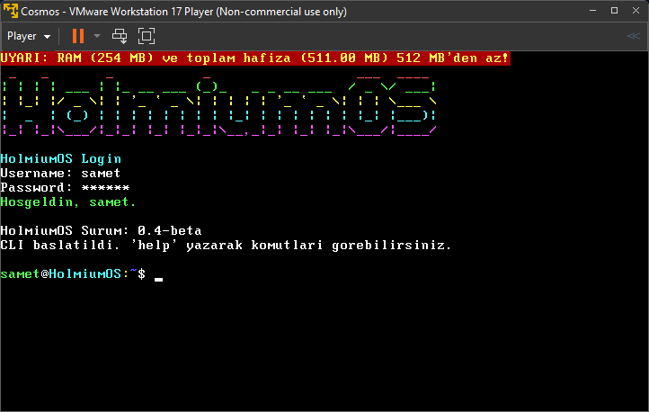

| | | |
| :---: | :---: | :---: |
|  | 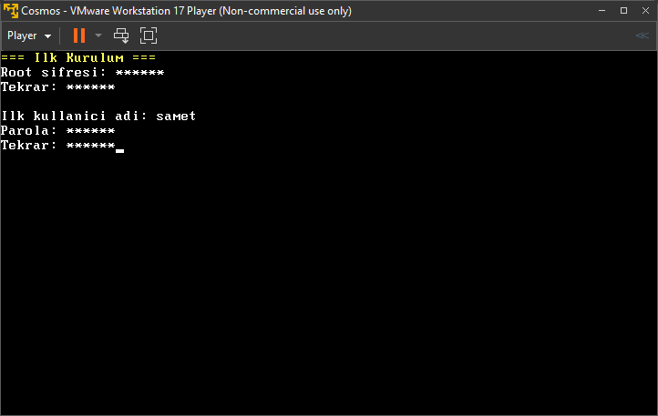 | 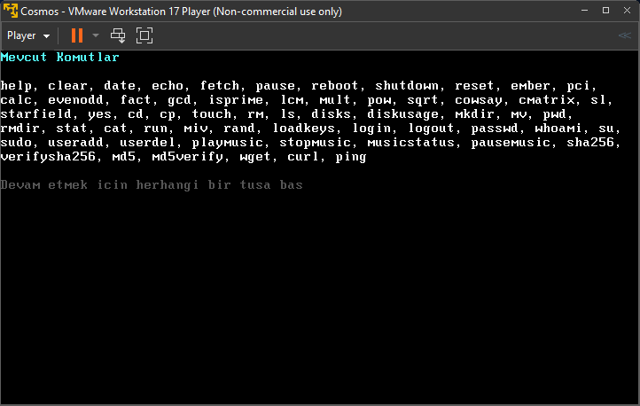 |
| 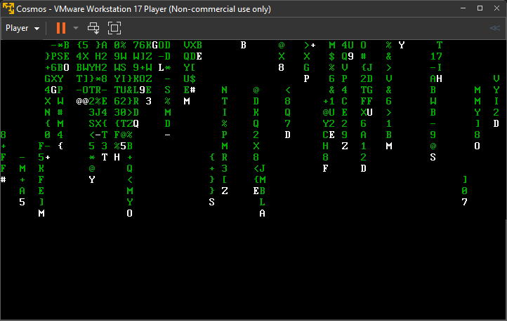 | 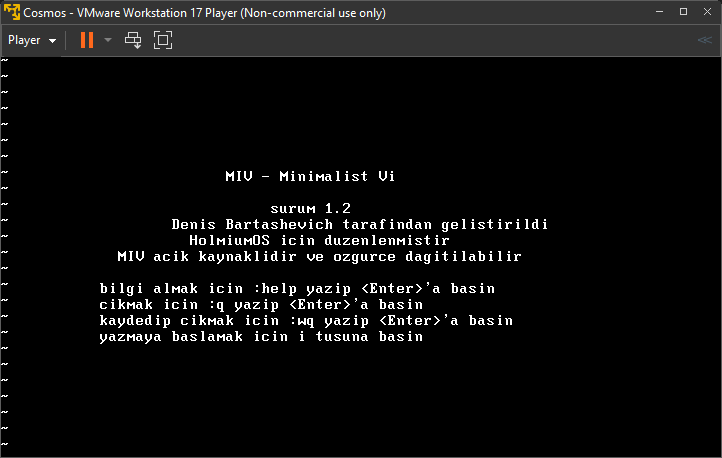 | 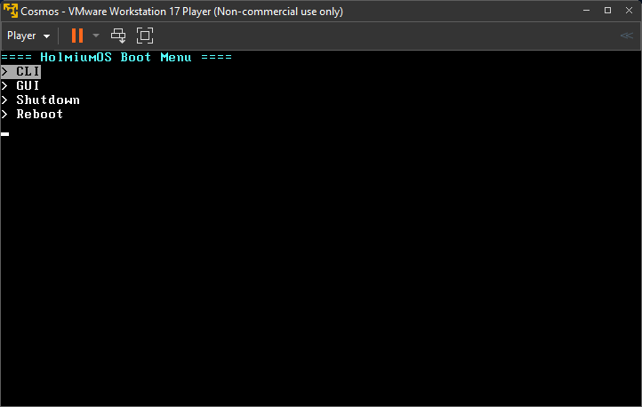 |
| 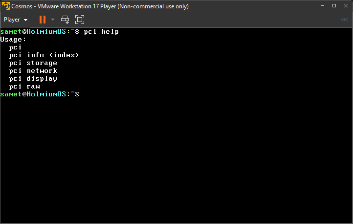 | 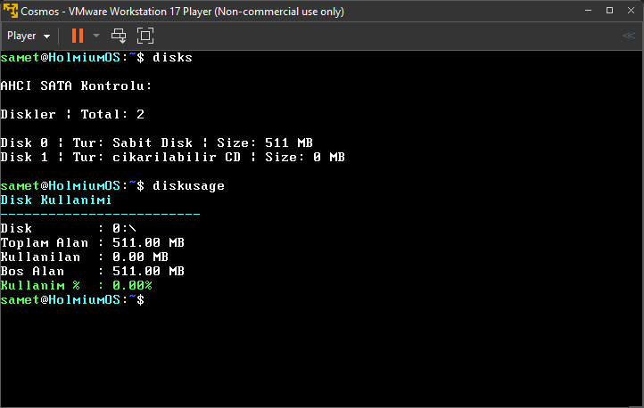 | 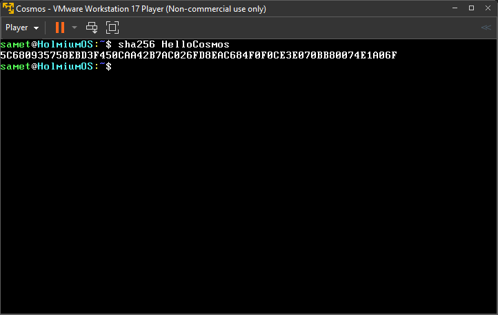 |
| 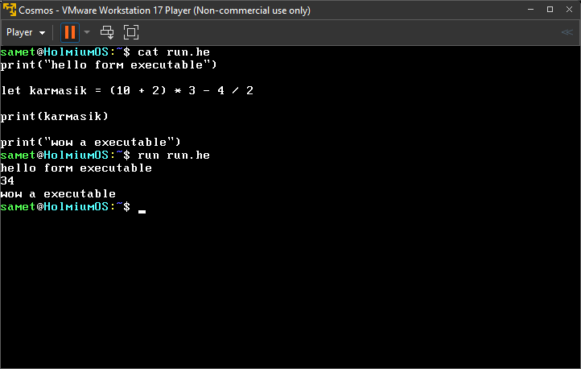 | 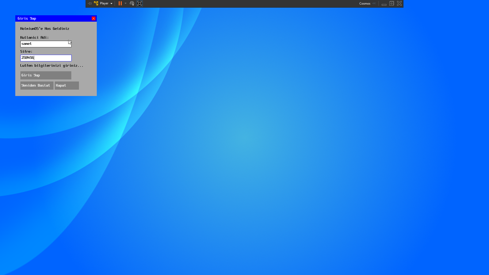 | 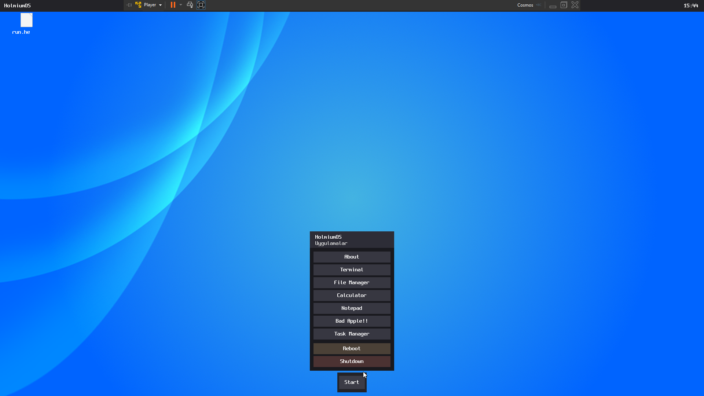 |
| 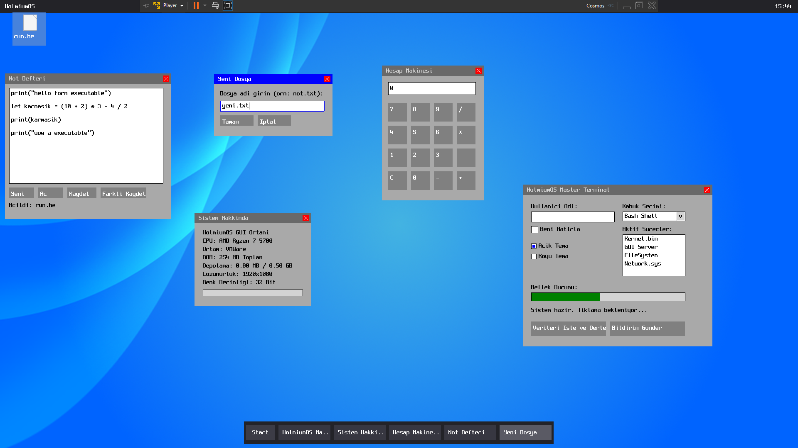 | | |

> **Note:** You can check out the `Screenshots/badapple.mp4` file in the repository to see HolmiumOS running the Bad Apple demo!

## Features

* Custom shell environment
* Modular command architecture
* User and permission management
* Filesystem management tools
* Cryptography utilities
* Advanced Window Management, UI Controls And Native Apps
* Network functionality
* Audio system support
* Custom interpreter support
* Hardware and system-level features
* CosmosOS-based kernel environment

## Requirements

* .NET 6 SDK
* CosmosOS Devkit
* Visual Studio 2022

## Status

HolmiumOS is actively under development. New system components and features are continuously being added.

## License

This project is licensed under the GNU General Public License v3.0 (GPLv3).
